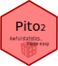

<!-- README.md is generated from README.Rmd. Please edit that file -->

# PITO2

<!-- badges: start -->
<!-- badges: end -->
<p align="center">

</p>

This is a satire statistical R package based on the counting-out rhyme
“Pito pito gorgorito”
(<https://es.wikipedia.org/wiki/Pito%2C_pito%2C_gorgorito>), which has
countless adaptations in all languages and is used when a random choice
is to be made.

The PITO2 package performs a **data independent variable selection**
(DIVS, see also [this
test](https://rdrr.io/cran/TeachingDemos/man/cortest.html)), based
purely on random chance.

## Installation

You definitely shouldn’t install nor use this package, but if you choose
to, do this:

``` r
devtools::install_github("RogerGinBer/PITO2")
```

## Example

This is a basic example which shows you how to (incorrectly) solve a
common problem:

``` r
library(PITO2)
metabolites <- paste("Metabolite", 1:100)
pitopito(metabolites, fdr = 0.05) #5% chance that any given metabolite is selected
#> [1] "Metabolite 9"   "Metabolite 18"  "Metabolite 28"  "Metabolite 50" 
#> [5] "Metabolite 51"  "Metabolite 59"  "Metabolite 100"
```
